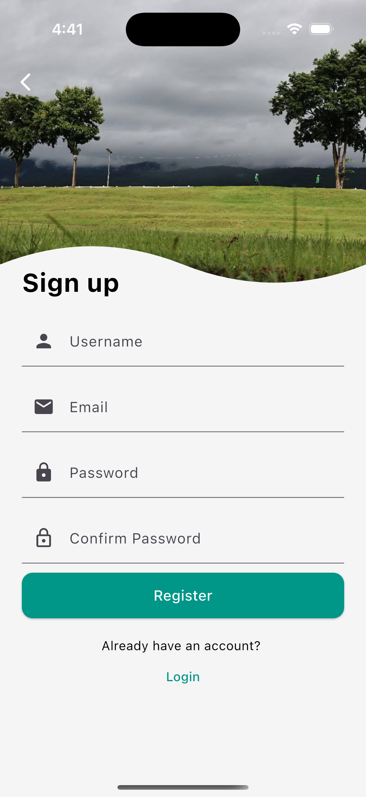
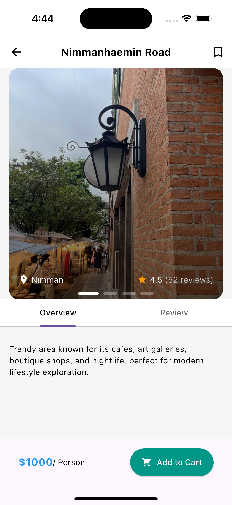

# NomadNorthTravel

**NomadNorthTravel** is a Flutter UI project built for study and practice purposes. The app is a conceptual travel companion focused on exploring the beauty, culture, and nature of Chiang Mai, Thailand.

## 📌 Purpose

This project was created to:

- Practice Flutter layout and UI design
- Explore stateful and stateless widgets
- Work with image assets and JSON-like data
- Build a concept travel app with a clean and modern design

## 🛠️ Features (UI Only)
- Onboarding Flow
- Login
- Register 
- Profile with gallery
- Popular destination listings ( Horizontal Scroll )
- Recommended travel package ( Vertical Scroll )
- All travel packages ( Card flip )
- Custom UI components

> Note: This is a front-end/UI-focused project and does not include backend or real-time data fetching.

## 📁 Assets

All images are stored locally under the `assets/images/` directory and referenced in `pubspec.yaml`.

## 📷 Screenshots
|  |  |  |
|----------|----------|----------|
|  |  |  |
|  |  |  |
|  |  |  |
|  |  |  |
|  |  |  |
|  |  |  |
|  |  |  |
|  |  |  |
|  |  |  | |

## 💡 Inspiration

The app is inspired by the idea of digital nomad travel in Northern Thailand — peaceful mountains, rich culture, and eco-tourism experiences.

## ✅ Credit
I got some design inspiration and reference ideas from those videos, but I took a different approach in structuring the widgets.
- https://www.youtube.com/watch?v=Tde4-NcL3GE&t
- https://www.youtube.com/watch?v=XHNrTK2UANs&t

---

Feel free to fork, explore, or build upon this for your own learning.
